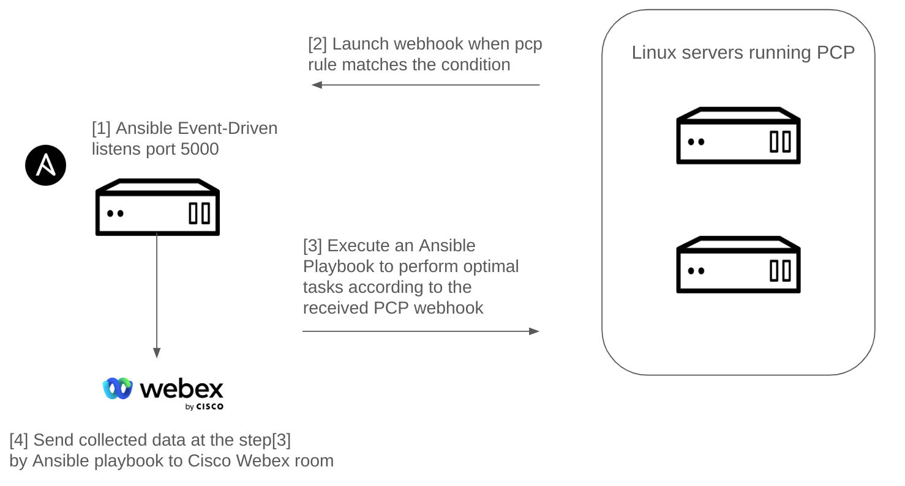
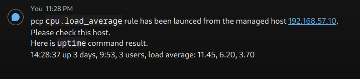

[](https://developer.cisco.com/codeexchange/github/repo/mahoutukaisali/GreenOps-Tracker)
[](https://developer.cisco.com/codeexchange/devenv/mahoutukaisali/GreenOps-Tracker/)

# GreenOps Tracker

## Overview
GreenOps Tracker is a project aimed at optimizing the use of computing resources. This not only reduces costs associated with server operations but also decreases CO2 emissions. Utilizing Performance Co-Pilot (PCP) and Ansible Event-Driven, this system monitors Linux servers, collects data in real-time when events occur, and automatically adjusts server configurations. Consequently, administrators can make data-driven decisions when selecting server resources. Moreover, since server resource management is automated by the system, manual intervention is minimized, preventing time loss and ensuring servers are always operated with optimal resources.

## Business Driver
The initiative behind **GreenOps Tracker** is to empower server administrators with precise, real-time data to make informed decisions about resource allocation, thereby minimizing unnecessary power consumption and reducing the overall carbon footprint of data centers.

## Why It Matters
As digital infrastructures expand, the energy consumption of data centers has become a critical issue. **GreenOps Tracker** addresses this by providing tools that not only help in reducing operational costs but also support environmental sustainability goals.

## Solution
**GreenOps Tracker** incorporates a dynamic system architecture featuring:
1. **Linux Servers with PCP**: These servers are configured to monitor various performance metrics. Upon detecting specific conditions, they trigger and send webhooks.
2. **Ansible Event-Driven Server**: This server receives webhooks from the Linux servers. In response, it automatically launches Ansible playbooks.
3. **Dynamic Data Collection**: The triggered playbooks are designed to collect detailed performance data such as CPU usage, memory usage, and filesystem status. This ensures that server administrators have access to the most relevant and current data.
4. **Automatic Resource Adjustment**: The Ansible playbooks executed by the Ansible Event Driven Server also automatically adjust server resources based on the performance data and conditions detected, ensuring optimal server operation without manual intervention.




## Future Extensions
To further enhance **GreenOps Tracker**, potential future features might include:
- **Expanded Metric Support**: Including additional metrics such as network performance and advanced thermal metrics.
- **Expanded Monitoring Support**: PCP supports integration with Grafana. Using these, we can measure server power consumption and verify how much reduction in power consumption we achieve by modifying server resources. 
- **Greater Automation**: Developing more sophisticated response mechanisms that automatically adjust configurations based on the data received.


<br>

# Installation
## Prerequisites
- This project needs 3 Linux servers assuming CentOS/Fedora/Red Hat Enterprise Linux as an OS type. If you uses Fedora, the latest Fedora 39 is required. If you uses Red Hat Enterprise Linux, RHEL 9.3 or higher is required.
- An OS user called `ansible` exists on all Fedora nodes and this user can become `sudo` user.
- `ansible` user can ssh key login to pcp servers from the ansible server.
- Make sure you have `Cisco Webex` account and a room that can receive notifications from the Ansible server.
  
### Step 1: Install Ansible and Ansible Event-Driven
The installation process follows the official document:
https://ansible.readthedocs.io/projects/rulebook/en/stable/installation.html

Run the below commands on one of the fedora node:
```
$ sudo dnf --assumeyes install java-17-openjdk python3-pip
$ export JAVA_HOME=/usr/lib/jvm/jre-17-openjdk
$ pip3 install ansible ansible-rulebook ansible-runner
```

Install ansible.eda collection:
```
$ ansible-galaxy collection install ansible.eda
```

### Step 2: Clone this "GreenOps Tracker" repository on the Ansible node
```
$ git clone https://github.com/mahoutukaisali/GreenOps-Tracker
```

### Step 3: Modify the cloned source code to suit your environments
Open `inventory.yml` file of this project and modify IP addresses and `sudo password`. Below is the current file contents. You can replace `192.168.57.10/192.168.57.11` with your pcp server's IP and replace `ansible_become_pass: changeme` with your `sudo password`.
```
---
all:
  children:
    pcp_servers:
      hosts:
        192.168.57.10:
          ansible_become_pass: changeme
        192.168.57.11:
          ansible_become_pass: changeme
```

Next, open vars/webhook.yml` file and replace `CHANGEME` part with your ansible server's actual IP address.
```
---
webhook_endpoint: "http://CHANGEME:5000/endpoint"
```

Next, open `playbooks/vars/webex.yml` file and replace `changeme` with the actual values. `room_id` is your Cisco Webex room ID, `token` is your Cisco Webex account's token.
```
---
room_id: changeme
token: changeme
```
For further information about Cisco Webex, please refer to the official documentation: https://developer.webex.com/docs

<br>

Now you can launch `pre_setup.yml` playbook on the Ansible server. This will install all the necessary packages on the pcp servers to run this project.
```
$ ansible-playbook pre_setup.yml
```

<br>

# Usage (Launch GreenOps Tracker project)
Now you can try `GreenOps Tracker` project. 

### Step 1: Run "ansible-rulebook" on the Ansible server. This will listen to 0.0.0.0:5000 on the Ansible server and wait to receive the payloads from pcp servers.
```
$  ansible-rulebook --rulebook pcpEventRules.yml -i inventory.yml --verbose
```

### Step 2: Put a load on the pcp server.　
We have already installed `stress-ng` package in pcp servers using `pre_setup.yml` playbook at the `Installation` step, so in this example, we can use `stress-ng` to put a load on the pcp server. You can load one of the pcp servers referring to the below example command.

example command:
```
$ stress-ng --cpu $(nproc) --vm 2 --fork 8 --switch 4 --timeout 120s -v
```
**Note: If the above command is not enough parameter to load a pcp server, try increasing the numbers to match the specifications of your server.**

### Step 3: Monitoring logs from Ansible Event-Driven. 
Once the Ansible server receives a webhook from a pcp server, one of a playbooks located under `playbooks` directory will be launched. In the following execution output example, a playbook `cpu.load_average.yml` is launched by Ansible Event-Driven to a pcp host `192.168.57.10` because Ansible Event-Driven can regocnize the source of a received webhook and a webhook includes `High 1-minute load average` as a message. 
```
2024-05-04 14:28:34,577 - aiohttp.access - INFO - 192.168.57.10 [04/May/2024:14:28:34 +0000] "POST /endpoint HTTP/1.1" 200 159 "-" "curl/8.2.1"

PLAY [EDA response to PMIE rule cpu.load_average] ******************************

TASK [Gathering Facts] *********************************************************
ok: [192.168.57.10]

TASK [ansible.builtin.include_vars] ********************************************
ok: [192.168.57.10]

TASK [Display ansible_eda.event.payload.pcp.pmie.message variable] *************
ok: [192.168.57.10] => {
    "msg": "ansible_eda.event.payload.pcp.pmie.message value: 11.2load@192.168.57.10"
}

TASK [Display ansible_eda.event.payload.pcp.pmie.rule variable] ****************
ok: [192.168.57.10] => {
    "msg": "ansible_eda.event.payload.pcp.pmie.rule value: High 1-minute load average"
}

TASK [Collect uptime data to check CPU load average over the past minutes] *****
changed: [192.168.57.10]

TASK [Make /opt writable directory] ********************************************
ok: [192.168.57.10]

TASK [Save uptime result] ******************************************************
changed: [192.168.57.10]

TASK [Cisco Webex Teams - Text Message to a Room] ******************************
ok: [192.168.57.10]

PLAY RECAP *********************************************************************
192.168.57.10              : ok=8    changed=2    unreachable=0    failed=0    skipped=0    rescued=0    ignored=0
```
### Step 4: Check your Cisco Webex Room
Additionally, you can see a message sent from Ansible Playbook in Cisco Webex room. In this screenshot, you can see `uptime` command result executed on a pcp host `192.168.57.10`. It's executed by Ansible Playbook. This allows you to check the state of the uptime when the event occurred. You won't miss real-time data.



<br>

# Configuration
In the above `Usage` section, `cpu.load_average.yml` playbook is launched by Ansible Event-Driven because an event matching one of the pcp rules `cpu.load_average`. In this project, there are more playbooks. Let me explain more 2 playbook files.

**playbooks/filesys.filling.yml**
This file is executed by Ansible EventDriven when an event defined in the PCP rule "filesys.filling" occurs. This playbook not only collects the state of the file system but also performs tasks to delete files in the /tmp directory of the monitored server (PCP server) if they haven't been used in the past 7 days. This allows for automatic resolution of a full file system state. Not only does it prevent troubles, but it also saves resources by removing unnecessary files.

Applicable parts in `playbooks/filesys.filling.yml`:
```
    - name: Collect file system space usage
      command: df -h
      register: result

    - name: Make /opt writable directory
      ansible.builtin.file:
        path: /opt
        state: directory
        mode: '0777'

    - name: Save `df -h` command result
      ansible.builtin.copy:
        content: "{{ result.stdout }}"
        dest: "/opt/filesys.filling_{{ lookup('pipe', 'date +%Y%m%d%H%M%S') }}.txt"
    
    - name: Delete unused files for 7 days
      command: find /tmp -type f -atime +7 -delete


    - name: Cisco Webex Teams - Text Message to a Room
      community.general.cisco_webex:
        recipient_type: roomId
        recipient_id: "{{ room_id }}"
        msg_type: markdown
        personal_token: "{{ token }}"
        msg: "pcp `filesys.filling` rule has been launced from the managed host {{ ansible_eda.event.payload.pcp.pmie.hostname }}. Please check this host.\nHere is `df -h` result.\n{{ result.stdout }}"

```

<br>

**playbooks/memory.exhausted.yml**
In cases where performance-related issues are not consistently occurring but rather sporadic, there may be a need to gather information by executing commands immediately when the issue arises. For example, to identify a process consuming excessive memory. This playbook will run `ps aux` command and send that result to Cisco Webex room.

Applicable parts in `playbooks/memory.exhausted.yml`.
```
    - name: Investigate which processes are consuming high memory
      command: ps aux --sort=-%mem | head
      register: processResult

    - name: Cisco Webex Teams - Text Message to a Room
      community.general.cisco_webex:
        recipient_type: roomId
        recipient_id: "{{ room_id }}"
        msg_type: markdown
        personal_token: "{{ token }}"
        msg: "pcp `memory.exhausted` rule has been launced from the managed host {{ ansible_eda.event.payload.pcp.pmie.hostname }}. Please check this host.\nHere is `ps aux` command result.\n{{ processResult.stdout }}"
```


# Conclusion
**GreenOps Tracker** is not just a monitoring tool; it is a strategic asset for sustainable IT management. By providing real-time insights and automated responses, it plays a pivotal role in optimizing server performance and advancing environmental sustainability in the tech industry.
